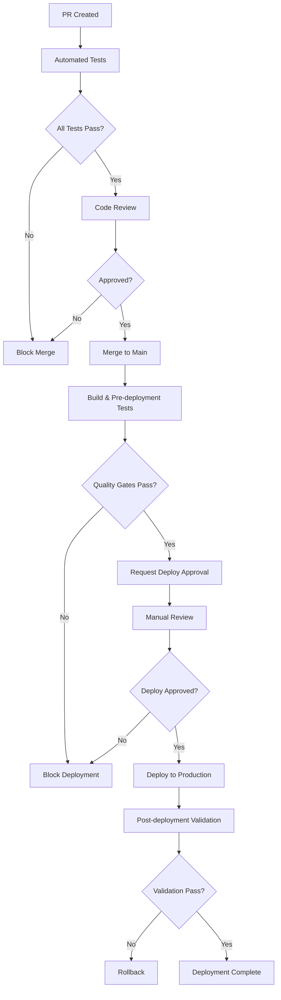

# Deployment Protection Rules Configuration

This document outlines the deployment protection rules and quality gates that should be configured in the GitHub repository settings.

## 🛡️ Branch Protection Rules

### Main Branch (Production)

Configure the following branch protection rules for the `main` branch:

```yaml
Branch Protection Settings:
- Restrict pushes that create files: false
- Require a pull request before merging: true
  - Require approvals: 2
  - Dismiss stale PR approvals when new commits are pushed: true
  - Require review from code owners: true
  - Restrict reviews to users with write access: true
- Require status checks to pass before merging: true
  - Require branches to be up to date before merging: true
  - Required status checks:
    - "🔍 Pre-flight Validation"
    - "🧪 Unit Tests"
    - "🔒 Security Tests" 
    - "🔗 Integration Tests"
    - "🎭 End-to-End Tests"
    - "🏗️ Build Validation"
    - "🚀 Pre-deployment Validation"
- Restrict pushes to matching branches: true
  - Allow administrators to bypass: false
  - Allow force pushes: false
- Allow deletions: false
```

### Develop Branch (Staging)

Configure the following branch protection rules for the `develop` branch:

```yaml
Branch Protection Settings:
- Require a pull request before merging: true
  - Require approvals: 1
  - Dismiss stale PR approvals when new commits are pushed: true
- Require status checks to pass before merging: true
  - Required status checks:
    - "🔍 Pre-flight Validation"
    - "🧪 Unit Tests" 
    - "🔒 Security Tests"
    - "🎭 Critical E2E Tests"
- Restrict pushes to matching branches: true
  - Allow administrators to bypass: true
- Allow deletions: false
```

## 🎯 Environment Protection Rules

### Production Environment

Configure deployment protection rules for the `production` environment:

```yaml
Environment Protection Rules:
- Required reviewers: 
  - @team-leads
  - @devops-team
- Wait timer: 0 minutes
- Prevent self-review: true
- Required status checks:
  - "📊 Pipeline Summary"
  - "✅ Post-deployment Validation"
- Deployment branches:
  - Selected branches: main
```

### Staging Environment

Configure deployment protection rules for the `staging` environment:

```yaml
Environment Protection Rules:
- Required reviewers: 
  - @dev-team
- Wait timer: 0 minutes
- Required status checks:
  - "🏗️ Build Validation"
- Deployment branches:
  - Selected branches: develop, main
```

## 🔐 Repository Secrets Configuration

Configure the following repository secrets:

### Required Secrets

```bash
# Supabase Configuration
SUPABASE_URL=https://your-project.supabase.co
SUPABASE_ANON_KEY=eyJhbGciOiJIUzI1NiIsInR5cCI6IkpXVCJ9...
SUPABASE_SERVICE_ROLE_KEY=eyJhbGciOiJIUzI1NiIsInR5cCI6IkpXVCJ9...

# Next.js Authentication
NEXTAUTH_SECRET=your-nextauth-secret-here
NEXTAUTH_URL=https://your-production-domain.com

# Public Environment Variables (for CI/CD)
NEXT_PUBLIC_SUPABASE_URL=https://your-project.supabase.co
NEXT_PUBLIC_SUPABASE_ANON_KEY=eyJhbGciOiJIUzI1NiIsInR5cCI6IkpXVCJ9...

# Deployment Tokens (if using external services)
VERCEL_TOKEN=your-vercel-deployment-token
NETLIFY_AUTH_TOKEN=your-netlify-auth-token

# Monitoring & Analytics (optional)
SENTRY_DSN=https://your-sentry-dsn
ANALYTICS_KEY=your-analytics-key
```

### Environment-specific Secrets

For staging environment:
```bash
SUPABASE_URL_STAGING=https://your-staging-project.supabase.co
SUPABASE_ANON_KEY_STAGING=staging-anon-key
NEXTAUTH_URL_STAGING=https://your-staging-domain.com
```

## 📋 Quality Gates Configuration

### Coverage Thresholds

```yaml
Coverage Requirements:
- Minimum Line Coverage: 80%
- Minimum Branch Coverage: 75%
- Minimum Function Coverage: 80%
- Minimum Statement Coverage: 80%

Coverage Enforcement:
- Block PR merge if coverage drops below threshold
- Require coverage report on all PRs
- Generate coverage trend reports
```

### Performance Thresholds

```yaml
Lighthouse Scores (minimum):
- Performance: 75/100
- Accessibility: 90/100
- Best Practices: 80/100
- SEO: 80/100

Core Web Vitals:
- First Contentful Paint (FCP): < 2.0s
- Largest Contentful Paint (LCP): < 4.0s
- Cumulative Layout Shift (CLS): < 0.1

Bundle Size Limits:
- Total build size: < 50MB
- Individual chunk size: < 5MB
- Bundle size increase threshold: 1MB (triggers warning)
```

### Security Requirements

```yaml
Security Gates:
- No critical vulnerabilities allowed
- No high vulnerabilities allowed
- All secrets must use environment variables
- License compliance check must pass
- CodeQL security analysis must pass

Dependency Management:
- Automatic security updates: enabled
- Vulnerable dependency alerts: enabled
- License compliance: GPLv3, AGPLv3 prohibited
```

## 🚀 Deployment Strategy

### Deployment Approval Flow



### Rollback Strategy

```yaml
Rollback Triggers:
- Post-deployment validation failures
- Critical performance regression
- Security vulnerability detection
- User-reported critical issues

Rollback Process:
1. Automatic rollback for validation failures
2. Manual rollback approval for performance issues
3. Immediate rollback for security issues
4. Notify team via Slack/Email

Rollback Testing:
- Validate rollback in staging environment
- Test rollback procedures monthly
- Document rollback times and procedures
```

## 📊 Monitoring & Alerting

### Deployment Monitoring

```yaml
Health Checks:
- Application startup validation
- Database connectivity
- External service availability  
- Authentication service health
- API endpoint responsiveness

Metrics Collection:
- Deployment success rate
- Deployment duration
- Rollback frequency
- Quality gate pass rate
- Security scan results

Alerts:
- Failed deployments (immediate)
- Quality gate failures (immediate)
- Security vulnerabilities (immediate)
- Performance regressions (within 1 hour)
- Coverage drops (daily summary)
```

### Notification Channels

```yaml
Slack Integration:
- Channel: #deployments
- Notifications:
  - Deployment start/completion
  - Quality gate failures
  - Security alerts
  - Performance warnings

Email Notifications:
- Recipients: dev-team@company.com
- Triggers:
  - Production deployment failures
  - Critical security vulnerabilities
  - Sustained quality gate failures

GitHub Issues:
- Auto-create for:
  - Security vulnerabilities
  - Recurring deployment failures
  - Performance regression patterns
```

## 🔧 Configuration Setup Commands

### 1. Enable Branch Protection (GitHub CLI)

```bash
# Main branch protection
gh api repos/:owner/:repo/branches/main/protection \
  --method PUT \
  --field required_status_checks='{"strict":true,"contexts":["🔍 Pre-flight Validation","🧪 Unit Tests","🔒 Security Tests","🔗 Integration Tests","🎭 End-to-End Tests","🏗️ Build Validation"]}' \
  --field enforce_admins=false \
  --field required_pull_request_reviews='{"required_approving_review_count":2,"dismiss_stale_reviews":true,"require_code_owner_reviews":true}' \
  --field restrictions=null

# Develop branch protection  
gh api repos/:owner/:repo/branches/develop/protection \
  --method PUT \
  --field required_status_checks='{"strict":true,"contexts":["🔍 Pre-flight Validation","🧪 Unit Tests","🔒 Security Tests"]}' \
  --field enforce_admins=true \
  --field required_pull_request_reviews='{"required_approving_review_count":1,"dismiss_stale_reviews":true}' \
  --field restrictions=null
```

### 2. Create Environment Protection Rules

```bash
# Production environment
gh api repos/:owner/:repo/environments/production \
  --method PUT \
  --field wait_timer=0 \
  --field reviewers='[{"type":"Team","id":TEAM_ID}]' \
  --field deployment_branch_policy='{"protected_branches":true,"custom_branch_policies":false}'

# Staging environment
gh api repos/:owner/:repo/environments/staging \
  --method PUT \
  --field wait_timer=0 \
  --field reviewers='[{"type":"Team","id":TEAM_ID}]' \
  --field deployment_branch_policy='{"protected_branches":false,"custom_branch_policies":true}'
```

### 3. Configure Security Alerts

```bash
# Enable vulnerability alerts
gh api repos/:owner/:repo/vulnerability-alerts \
  --method PUT

# Enable automated security updates  
gh api repos/:owner/:repo/automated-security-fixes \
  --method PUT

# Enable dependency graph
gh api repos/:owner/:repo \
  --method PATCH \
  --field has_vulnerability_alerts=true
```

## 📝 Implementation Checklist

### Phase 1: Basic Protection (Week 1)
- [ ] Configure branch protection for main and develop
- [ ] Set up required status checks
- [ ] Configure repository secrets
- [ ] Enable security alerts and updates
- [ ] Test basic CI/CD pipeline

### Phase 2: Quality Gates (Week 1)
- [ ] Configure coverage thresholds
- [ ] Set up performance monitoring
- [ ] Implement security scanning
- [ ] Create deployment environments
- [ ] Test quality gate enforcement

### Phase 3: Advanced Monitoring (Week 2)
- [ ] Set up deployment monitoring
- [ ] Configure alert notifications
- [ ] Implement rollback procedures
- [ ] Create monitoring dashboards
- [ ] Document incident response

### Phase 4: Team Training (Week 2)
- [ ] Train team on new workflows
- [ ] Document deployment procedures
- [ ] Create troubleshooting guides
- [ ] Establish review processes
- [ ] Schedule regular process reviews

---

**Note**: Replace placeholder values (`:owner`, `:repo`, `TEAM_ID`, etc.) with actual values for your repository and organization.

This configuration ensures robust deployment protection while maintaining development velocity through automated quality gates and clear approval processes.