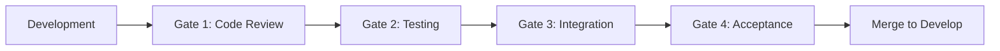

# 🌳 Branching & Check-in Strategy

## Overview
This document defines our Git branching strategy, check-in process, and acceptance gates for the AI Readiness Platform enhancement project.

## 🔀 Branching Strategy

### Branch Hierarchy
```
main (production)
├── develop (integration)
│   ├── feature/phase-1-jtbd-framework
│   │   ├── feat/jtbd-schema
│   │   ├── feat/jtbd-scoring
│   │   └── feat/jtbd-api
│   ├── feature/phase-2-voice-recording
│   │   ├── feat/voice-ui
│   │   ├── feat/voice-storage
│   │   └── feat/voice-transcription
│   ├── feature/phase-3-ai-analysis
│   │   ├── feat/llm-integration
│   │   ├── feat/sentiment-analysis
│   │   └── feat/theme-extraction
│   ├── feature/phase-4-org-insights
│   │   ├── feat/insights-aggregation
│   │   ├── feat/insights-dashboard
│   │   └── feat/segment-analysis
│   ├── feature/phase-5-enhanced-survey
│   ├── feature/phase-6-ui-updates
│   ├── feature/phase-7-testing
│   ├── feature/phase-8-documentation
│   └── feature/phase-9-cleanup
└── hotfix/* (emergency fixes)
```

### Branch Naming Convention
```
feature/phase-{number}-{description}  # Phase branches
feat/{specific-feature}               # Feature branches
fix/{issue-description}               # Bug fixes
hotfix/{critical-issue}              # Production hotfixes
chore/{task-description}             # Maintenance tasks
```

## 🚪 Check-in Gates & Acceptance Criteria

### Phase Gate System
Each phase must pass through 4 gates before merging to develop:



---

## 📝 Phase-by-Phase Check-in Process

### Phase 1: JTBD Framework Core
**Branch:** `feature/phase-1-jtbd-framework`

#### Gate 1: Code Review Checklist
- [ ] Schema changes reviewed
- [ ] Zod validations correct
- [ ] Service methods documented
- [ ] No TypeScript errors
- [ ] ESLint passing

#### Gate 2: Testing Requirements
```bash
# Required test coverage
npm run test:jtbd
- Unit tests: >95% coverage
- Integration tests: All passing
- Schema validation tests: Complete
```

#### Gate 3: Integration Verification
- [ ] Database migrations successful
- [ ] API endpoints responding
- [ ] No breaking changes to existing features
- [ ] Performance benchmarks met (<200ms response)

#### Gate 4: Acceptance Criteria
```gherkin
Feature: JTBD Implementation Complete
  Given the JTBD framework is implemented
  When I create a survey
  Then I can map questions to all 5 JTBD forces
  And force scores calculate correctly
  And API returns JTBD analysis
```

#### Check-in Process
```bash
# Developer completes feature
git checkout -b feat/jtbd-schema
git add .
git commit -m "feat: implement JTBD schema with force mapping"
git push origin feat/jtbd-schema

# Create PR to phase branch
gh pr create --base feature/phase-1-jtbd-framework

# After sub-feature approval, merge to phase branch
git checkout feature/phase-1-jtbd-framework
git merge feat/jtbd-schema

# When all sub-features complete, create phase PR
gh pr create --base develop --title "Phase 1: JTBD Framework Implementation"
```

---

### Phase 2: Voice Recording Support
**Branch:** `feature/phase-2-voice-recording`

#### Gate 1: Code Review Checklist
- [ ] Voice component architecture approved
- [ ] Storage implementation secure
- [ ] Transcription service integrated
- [ ] Error handling comprehensive
- [ ] Accessibility compliant

#### Gate 2: Testing Requirements
```bash
npm run test:voice
- Voice recording tests: Pass on Chrome/Safari/Firefox
- Upload tests: Handle network failures
- Transcription tests: >90% accuracy
- Playback tests: Cross-browser compatible
```

#### Gate 3: Integration Verification
- [ ] Voice files upload to storage
- [ ] Transcriptions process within 30s
- [ ] Database stores voice metadata
- [ ] Existing text responses unaffected

#### Gate 4: Acceptance Criteria
```gherkin
Feature: Voice Recording Complete
  Given voice recording is enabled
  When I record a 2-minute response
  Then recording uploads successfully
  And transcription generates accurately
  And I can play back my recording
  And I can edit the transcription
```

---

### Phase 3: AI/LLM Response Analysis
**Branch:** `feature/phase-3-ai-analysis`

#### Gate 1: Code Review Checklist
- [ ] LLM prompts version controlled
- [ ] Rate limiting implemented
- [ ] Cost tracking in place
- [ ] PII scrubbing verified
- [ ] Fallback mechanisms ready

#### Gate 2: Testing Requirements
```bash
npm run test:ai
- LLM integration tests: Mock responses work
- Sentiment analysis tests: Accuracy >85%
- Theme extraction tests: Relevant themes
- Batch processing tests: 100 responses in <5min
```

#### Gate 3: Integration Verification
- [ ] LLM API connected and authenticated
- [ ] Analysis results store in database
- [ ] Costs tracked per request
- [ ] Error handling for API failures

#### Gate 4: Acceptance Criteria
```gherkin
Feature: AI Analysis Complete
  Given 50 survey responses
  When analysis is triggered
  Then sentiment scores generate for all
  And themes extract correctly
  And insights are actionable
  And processing completes in <5min
```

---

### Phase 4: Organization Insights
**Branch:** `feature/phase-4-org-insights`

#### Gate 1: Code Review Checklist
- [ ] Aggregation logic correct
- [ ] Statistical calculations verified
- [ ] Dashboard components optimized
- [ ] Data visualization clear
- [ ] Export functionality working

#### Gate 2: Testing Requirements
```bash
npm run test:insights
- Aggregation tests: Math verified
- Segment tests: Filters work correctly
- Performance tests: 1000 responses in <10s
- Export tests: PDF/CSV generation works
```

#### Gate 3: Integration Verification
- [ ] Dashboard loads with real data
- [ ] Charts render without lag
- [ ] Segment filtering works
- [ ] Export generates valid files

#### Gate 4: Acceptance Criteria
```gherkin
Feature: Organization Insights Complete
  Given 100+ responses analyzed
  When I view the insights dashboard
  Then I see overall readiness score
  And JTBD force breakdown displays
  And I can filter by segment
  And I can export to PDF
```

---

## 🔄 Incremental Check-in Schedule

### Daily Check-ins
```yaml
Time: 5:00 PM (end of day)
Format: Commit to feature branch
Requirements:
  - Code compiles
  - Tests pass locally
  - No merge conflicts
Message Format: "WIP: [task description] - [status]"
```

### Weekly Integration
```yaml
Day: Friday
Time: 3:00 PM
Process:
  1. Merge sub-features to phase branch
  2. Run integration tests
  3. Deploy to staging
  4. Demo to stakeholders
  5. Gather feedback
```

### Phase Completion
```yaml
Trigger: All acceptance criteria met
Process:
  1. Create PR from phase branch to develop
  2. Full code review (2 reviewers minimum)
  3. Run complete test suite
  4. Performance validation
  5. Security scan
  6. Stakeholder approval
  7. Merge to develop
  8. Deploy to staging
  9. Smoke tests
  10. Sign-off for next phase
```

## 📊 Progress Tracking

### Phase Completion Metrics
```typescript
interface PhaseMetrics {
  phase: string;
  startDate: Date;
  targetDate: Date;
  actualDate?: Date;
  featuresCompleted: number;
  featuresTotal: number;
  testCoverage: number;
  bugsFound: number;
  bugsResolved: number;
  acceptanceCriteriaMet: boolean;
}
```

### Dashboard View
```
Phase 1: JTBD Framework     ████████░░ 80% [8/10 tasks]
  ✅ Schema implementation
  ✅ Force mapping
  ✅ Scoring algorithm
  ✅ API endpoints
  ✅ Unit tests
  ✅ Integration tests
  🔄 Documentation
  🔄 Performance optimization
  ⭕ Stakeholder approval
  ⭕ Merge to develop

Phase 2: Voice Recording    ███░░░░░░░ 30% [3/10 tasks]
  ✅ UI components
  ✅ Recording logic
  🔄 Storage integration
  ⭕ Transcription service
  ⭕ Playback functionality
  ...
```

## 🚨 Rollback Procedures

### Feature Branch Rollback
```bash
# If feature causes issues
git checkout feature/phase-X
git revert HEAD~N  # Revert last N commits
git push origin feature/phase-X
```

### Phase Rollback
```bash
# If entire phase needs rollback
git checkout develop
git revert -m 1 <merge-commit-hash>
git push origin develop

# Deploy previous version
npm run deploy:rollback
```

### Hotfix Process
```bash
# For critical production issues
git checkout -b hotfix/critical-issue main
# Fix issue
git commit -m "hotfix: resolve critical issue"
git push origin hotfix/critical-issue

# Fast-track review and merge
gh pr create --base main --title "HOTFIX: Critical Issue"
# After approval
git checkout main
git merge hotfix/critical-issue
git checkout develop
git merge hotfix/critical-issue
```

## 📈 Acceptance Criteria Verification

### Automated Checks (CI/CD)
```yaml
name: Phase Gate Validation
on:
  pull_request:
    branches: [develop]

jobs:
  gate-1-code-quality:
    - ESLint
    - TypeScript check
    - Prettier format
    - Code coverage >90%
    
  gate-2-testing:
    - Unit tests
    - Integration tests
    - E2E tests (if applicable)
    - Performance tests
    
  gate-3-integration:
    - Build succeeds
    - Deploy to test environment
    - Smoke tests pass
    - No breaking changes
    
  gate-4-acceptance:
    - Acceptance tests (Cucumber/Gherkin)
    - Accessibility scan
    - Security scan
    - Performance benchmarks
```

### Manual Verification Checklist
```markdown
## Phase X Completion Checklist

### Functionality
- [ ] All user stories completed
- [ ] Acceptance criteria verified
- [ ] Edge cases handled
- [ ] Error states implemented

### Quality
- [ ] Code review approved (2+ reviewers)
- [ ] No critical bugs
- [ ] Performance targets met
- [ ] Security requirements satisfied

### Documentation
- [ ] API documentation updated
- [ ] User guide written
- [ ] README updated
- [ ] Inline comments added

### Stakeholder
- [ ] Demo completed
- [ ] Feedback incorporated
- [ ] Sign-off received
- [ ] Next phase unblocked
```

## 🎯 Success Criteria per Phase

### Phase Success Metrics
| Phase | Success Criteria | Target | Acceptable |
|-------|-----------------|--------|------------|
| Phase 1 | JTBD Coverage | 100% | 95% |
| Phase 1 | Force Scoring Accuracy | 100% | 98% |
| Phase 2 | Voice Recording Success | 99% | 95% |
| Phase 2 | Transcription Accuracy | 95% | 90% |
| Phase 3 | AI Analysis Time | <3s | <5s |
| Phase 3 | Sentiment Accuracy | 90% | 85% |
| Phase 4 | Dashboard Load Time | <1s | <2s |
| Phase 4 | Insight Generation | <10s | <30s |
| Phase 5 | Survey Completion Rate | +30% | +20% |
| Phase 6 | Mobile Responsiveness | 100% | 100% |
| Phase 7 | Test Coverage | 95% | 90% |
| Phase 8 | Documentation Coverage | 100% | 95% |
| Phase 9 | Code Reduction | 30% | 20% |

## 🔔 Notification Strategy

### Automated Notifications
```yaml
Slack/Discord Integration:
  - PR created: #dev-prs channel
  - Tests failed: #dev-alerts channel
  - Gate passed: #dev-progress channel
  - Phase complete: #general channel
  
Email Notifications:
  - Stakeholders: Phase completion
  - Team: Daily summary
  - Blockers: Immediate escalation
```

### Status Reports
```markdown
## Weekly Status Report Template

**Phase:** [Current Phase]
**Week:** [Week Number]
**Status:** 🟢 On Track | 🟡 At Risk | 🔴 Blocked

### Completed This Week
- ✅ [Task 1]
- ✅ [Task 2]

### In Progress
- 🔄 [Task 3] - 70% complete
- 🔄 [Task 4] - 40% complete

### Blockers
- 🚨 [Blocker description]

### Next Week Plan
- [ ] [Planned task 1]
- [ ] [Planned task 2]

### Metrics
- Test Coverage: X%
- Bugs Found: X
- Bugs Fixed: X
- Velocity: X story points
```

---

## 🚀 Getting Started

1. **Clone and Setup**
```bash
git clone [repo]
git checkout develop
git checkout -b feature/phase-1-jtbd-framework
```

2. **Daily Workflow**
```bash
# Start your day
git pull origin develop
git checkout your-feature-branch

# Make changes
git add .
git commit -m "feat: descriptive message"
git push origin your-feature-branch

# Create PR when ready
gh pr create --base parent-branch
```

3. **Phase Completion**
```bash
# Ensure all tests pass
npm run test:all
npm run lint
npm run build

# Create phase PR
gh pr create --base develop --title "Phase X: [Description]"

# After approval and merge
git checkout develop
git pull origin develop
```

---

*This strategy ensures quality gates at every level while maintaining development velocity.*

**Version:** 1.0.0  
**Last Updated:** 2025-01-08