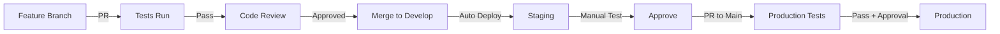

# 🛡️ Deployment Protection System

This project implements multiple layers of protection to prevent untested code from reaching production.

## 🎯 Overview

**YOU CANNOT DEPLOY TO PRODUCTION WITHOUT:**
1. ✅ Passing all tests
2. ✅ Testing database migrations
3. ✅ Deploying to staging first
4. ✅ Getting manual approval
5. ✅ Passing GitHub branch protection

## 🔒 Protection Layers

### Layer 1: Local Protection
```bash
# This script blocks deployment if tests haven't passed
./scripts/enforce-testing.sh production
```

### Layer 2: GitHub Actions
- **Automatic testing** on every PR
- **Migration testing** with PostgreSQL
- **Required status checks** before merge
- **Manual approval** for production

### Layer 3: Vercel Configuration
- **Deployment disabled** for direct pushes to main
- **Staging deployment** required first
- **Environment variables** separated by environment

### Layer 4: Branch Protection (GitHub Settings)
Go to Settings > Branches and configure:
- ✅ Require PR reviews (1 minimum)
- ✅ Dismiss stale reviews
- ✅ Require status checks:
  - `test-suite`
  - `test-migrations`
- ✅ Require branches to be up to date
- ✅ Include administrators
- ✅ Restrict who can push to main

## 📋 Deployment Workflow

### Development → Staging → Production



## 🚀 How to Deploy

### 1. Deploy to Staging
```bash
# Automatically deploys when merged to develop branch
git checkout develop
git merge feature/your-feature
git push
```

### 2. Test in Staging
- Visit staging URL
- Run smoke tests
- Verify migrations worked

### 3. Approve Staging
```bash
# Mark staging as approved
./scripts/enforce-testing.sh approve-staging
```

### 4. Deploy to Production
```bash
# Create PR from develop to main
# After approval and tests pass, it auto-deploys
```

## 🔴 What Gets Blocked

### ❌ Direct Push to Main
```bash
git push origin main  # BLOCKED by branch protection
```

### ❌ Untested Migrations
```bash
# If migrations changed without testing
vercel --prod  # BLOCKED by enforce-testing.sh
```

### ❌ Skipping Staging
```bash
# Trying to deploy to production without staging
# BLOCKED by GitHub Actions requirement
```

## 🛠️ Environment Setup

### Required Secrets in GitHub
```
VERCEL_TOKEN
SUPABASE_ACCESS_TOKEN
SUPABASE_DB_PASSWORD
STAGING_PROJECT_ID
PRODUCTION_PROJECT_ID
```

### Required in Vercel
```
# Staging Environment
NEXT_PUBLIC_SUPABASE_URL
NEXT_PUBLIC_SUPABASE_ANON_KEY
SUPABASE_SERVICE_KEY

# Production Environment (separate values)
NEXT_PUBLIC_SUPABASE_URL
NEXT_PUBLIC_SUPABASE_ANON_KEY
SUPABASE_SERVICE_KEY
```

## 🧪 Testing Migrations

### Local Testing
```bash
cd test-infrastructure
docker-compose up -d
./migration-manager.sh test ../FIX_EXISTING_DATABASE.sql
```

### CI Testing
Automatically runs on every PR that changes SQL files.

## 🚨 Emergency Procedures

### If Production Deploy Fails
1. **DON'T PANIC** - Nothing was deployed
2. Check GitHub Actions logs
3. Fix the issue
4. Re-run deployment

### If Production Has Issues
1. **Revert in Vercel Dashboard**
   - Go to Deployments
   - Find last working deployment
   - Click "Promote to Production"

2. **Database Rollback**
   ```sql
   -- Use rollback script from supabase/migrations/rollback/
   ```

## 📊 Monitoring

### Check Deployment Status
- GitHub Actions: `.github/workflows/deployment-protection.yml`
- Vercel Dashboard: Shows all deployments
- Supabase Dashboard: Database health

### Alerts
Set up monitoring for:
- Failed deployments
- Database errors
- API errors

## 🔧 Maintenance

### Update Protection Rules
1. Edit `.github/workflows/deployment-protection.yml`
2. Update `scripts/enforce-testing.sh`
3. Modify branch protection in GitHub Settings

### Add New Checks
Add to GitHub Actions workflow:
```yaml
- name: New Safety Check
  run: |
    # Your check here
```

## ⚠️ Important Notes

1. **NEVER disable branch protection** - It's there for a reason
2. **ALWAYS test migrations** in test environment first
3. **NEVER share production secrets** in code or logs
4. **ALWAYS use staging** before production
5. **DOCUMENT any bypasses** if absolutely necessary

## 🤖 For AI Assistants

**YOU MUST:**
- Run `./scripts/enforce-testing.sh` before suggesting deployment
- Check if migrations have been tested
- Verify staging deployment happened first
- Never bypass these protections

**YOU CANNOT:**
- Deploy directly to production
- Skip test requirements
- Ignore failed checks
- Bypass branch protection

This system prevents me (and you) from accidentally breaking production!