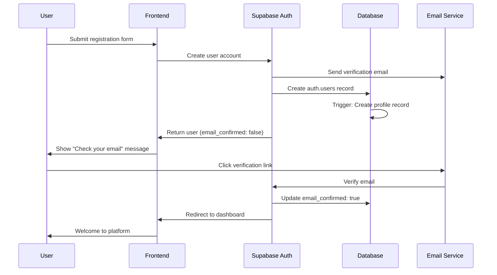
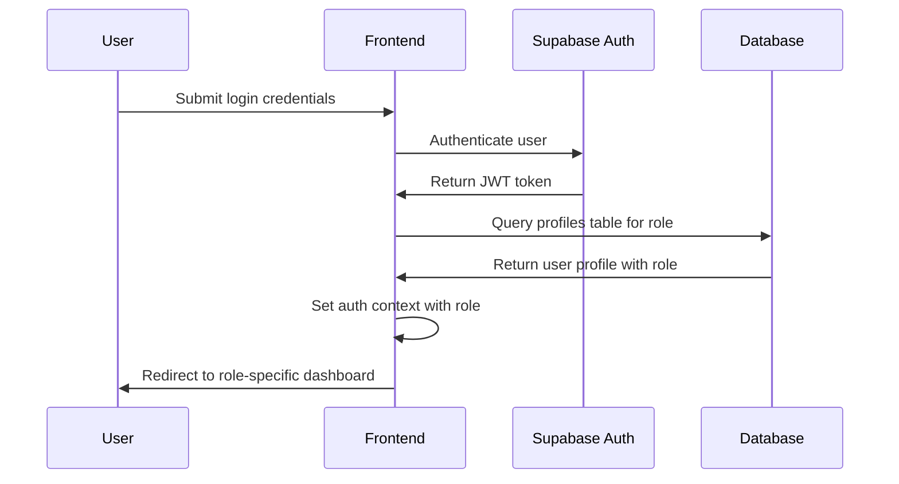
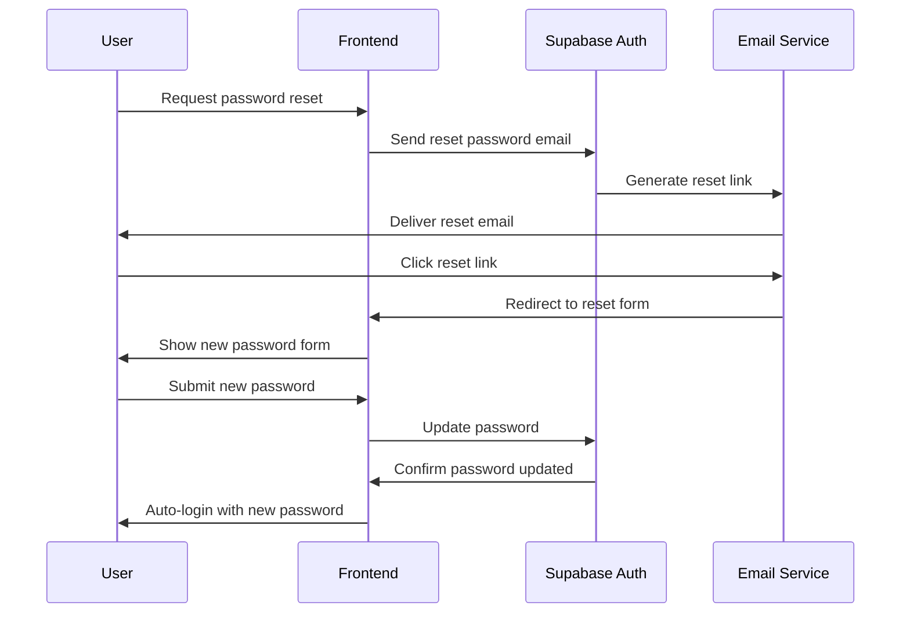

# Authentication System Architecture

## Overview

This document outlines the comprehensive authentication system architecture for the AI Readiness Assessment platform, featuring three-tier role-based access control, secure session management, and modern authentication patterns.

## System Components

### 1. Authentication Provider: Supabase Auth

**Primary Choice**: Supabase Auth provides enterprise-grade authentication with built-in security features:
- Email/password authentication
- Email verification flows
- Password reset functionality
- Session management with JWTs
- Row Level Security (RLS) integration
- Multi-factor authentication (future)

**Benefits**:
- Production-ready security
- Seamless integration with Supabase database
- Built-in email templates and SMTP
- Compliance with security standards
- Automatic session refresh

### 2. Role-Based Access Control (RBAC)

#### Role Hierarchy
```
admin (System Administrator)
├── Full platform access
├── Cross-organization data access
├── User management capabilities
└── System configuration

org_admin (Organization Administrator)  
├── Organization-specific access
├── Team member management
├── Organization analytics
└── Export organization reports

user (Standard User)
├── Survey participation
├── Personal results viewing
├── Account management
└── Basic profile settings
```

#### Permission Matrix
| Feature | user | org_admin | admin |
|---------|------|-----------|-------|
| Take surveys | ✅ | ✅ | ✅ |
| View own responses | ✅ | ✅ | ✅ |
| View org surveys | ❌ | ✅ | ✅ |
| View all surveys | ❌ | ❌ | ✅ |
| Export org reports | ❌ | ✅ | ✅ |
| Export all reports | ❌ | ❌ | ✅ |
| Manage org users | ❌ | ✅ | ✅ |
| Manage all users | ❌ | ❌ | ✅ |
| System settings | ❌ | ❌ | ✅ |

## Architecture Components

### 1. Authentication Context

```typescript
interface AuthUser {
  id: string;
  email: string;
  role: 'user' | 'org_admin' | 'admin';
  organizationId?: string;
  profile: UserProfile;
  session: Session;
}

interface AuthContext {
  user: AuthUser | null;
  loading: boolean;
  signIn: (email: string, password: string) => Promise<void>;
  signUp: (email: string, password: string) => Promise<void>;
  signOut: () => Promise<void>;
  resetPassword: (email: string) => Promise<void>;
  updateProfile: (updates: Partial<UserProfile>) => Promise<void>;
  hasPermission: (permission: Permission) => boolean;
}
```

### 2. Protected Route System

```typescript
interface ProtectedRouteProps {
  children: React.ReactNode;
  requiredRole?: Role;
  requiredPermission?: Permission;
  fallback?: React.ReactNode;
  redirectTo?: string;
}

// Usage examples:
<ProtectedRoute requiredRole="admin">
  <AdminDashboard />
</ProtectedRoute>

<ProtectedRoute requiredPermission="view_org_surveys">
  <OrganizationSurveys />
</ProtectedRoute>
```

### 3. Role-Based Navigation

```typescript
interface NavigationItem {
  label: string;
  path: string;
  icon: React.ComponentType;
  requiredRole?: Role;
  requiredPermission?: Permission;
}

const navigationConfig: NavigationItem[] = [
  { label: 'Dashboard', path: '/dashboard', icon: Home },
  { label: 'Take Survey', path: '/survey', icon: FileText },
  { label: 'My Results', path: '/results', icon: BarChart },
  { 
    label: 'Team Analytics', 
    path: '/team', 
    icon: Users, 
    requiredRole: 'org_admin' 
  },
  { 
    label: 'Admin Console', 
    path: '/admin', 
    icon: Settings, 
    requiredRole: 'admin' 
  },
];
```

## Authentication Flows

### 1. User Registration Flow



### 2. Login Flow with Role Determination



### 3. Password Reset Flow



## Session Management

### 1. JWT Token Handling

```typescript
interface SessionConfig {
  accessTokenExpiry: number; // 1 hour
  refreshTokenExpiry: number; // 7 days
  autoRefreshThreshold: number; // 5 minutes before expiry
  maxSessionDuration: number; // 24 hours
}

class SessionManager {
  private refreshTimer: NodeJS.Timeout | null = null;
  
  public startAutoRefresh(): void {
    this.refreshTimer = setInterval(() => {
      this.checkAndRefreshToken();
    }, 60000); // Check every minute
  }
  
  private async checkAndRefreshToken(): Promise<void> {
    const session = await supabase.auth.getSession();
    if (this.shouldRefreshToken(session)) {
      await supabase.auth.refreshSession();
    }
  }
  
  private shouldRefreshToken(session: Session): boolean {
    const expiresAt = new Date(session.expires_at * 1000);
    const now = new Date();
    const timeUntilExpiry = expiresAt.getTime() - now.getTime();
    return timeUntilExpiry < this.config.autoRefreshThreshold;
  }
}
```

### 2. Secure Session Storage

```typescript
class SecureStorage {
  private static encrypt(data: string): string {
    // Use browser's SubtleCrypto API for encryption
    return btoa(data); // Simplified for example
  }
  
  private static decrypt(encrypted: string): string {
    return atob(encrypted); // Simplified for example
  }
  
  public static setSecureItem(key: string, value: string): void {
    const encrypted = this.encrypt(value);
    sessionStorage.setItem(key, encrypted);
  }
  
  public static getSecureItem(key: string): string | null {
    const encrypted = sessionStorage.getItem(key);
    return encrypted ? this.decrypt(encrypted) : null;
  }
}
```

## Database Security

### 1. Row Level Security Policies

```sql
-- Users can only see their own profile
CREATE POLICY "Users can view own profile" ON profiles
FOR SELECT USING (user_id = auth.uid());

-- Org admins can see profiles from their organization
CREATE POLICY "Org admins can view org profiles" ON profiles
FOR SELECT USING (
  organization_id IN (
    SELECT organization_id FROM profiles 
    WHERE user_id = auth.uid() AND role = 'org_admin'
  )
);

-- System admins can see all profiles
CREATE POLICY "Admins can view all profiles" ON profiles
FOR SELECT USING (
  EXISTS (
    SELECT 1 FROM profiles 
    WHERE user_id = auth.uid() AND role = 'admin'
  )
);
```

### 2. Role Assignment Logic

```sql
-- Function to automatically assign roles on user creation
CREATE OR REPLACE FUNCTION handle_new_user()
RETURNS TRIGGER AS $$
BEGIN
  INSERT INTO public.profiles (user_id, email, role, organization_id)
  VALUES (
    NEW.id,
    NEW.email,
    CASE 
      -- System admin assignment
      WHEN NEW.email = 'admin@aireadiness.com' THEN 'admin'
      -- Org admin assignment based on email domain
      WHEN EXISTS (
        SELECT 1 FROM organizations 
        WHERE admin_email_domain = split_part(NEW.email, '@', 2)
      ) THEN 'org_admin'
      -- Default to user role
      ELSE 'user'
    END,
    -- Assign organization for org admins
    CASE 
      WHEN EXISTS (
        SELECT id FROM organizations 
        WHERE admin_email_domain = split_part(NEW.email, '@', 2)
      ) THEN (
        SELECT id FROM organizations 
        WHERE admin_email_domain = split_part(NEW.email, '@', 2)
        LIMIT 1
      )
      ELSE NULL
    END
  );
  RETURN NEW;
END;
$$ LANGUAGE plpgsql SECURITY DEFINER;
```

## Frontend Integration

### 1. Auth Hook Implementation

```typescript
import { useAuth } from '@/contexts/AuthContext';

export function useAuthGuard(requiredRole?: Role) {
  const { user, loading } = useAuth();
  const router = useRouter();
  
  useEffect(() => {
    if (!loading) {
      if (!user) {
        router.push('/login');
        return;
      }
      
      if (requiredRole && !hasRole(user.role, requiredRole)) {
        router.push('/unauthorized');
        return;
      }
    }
  }, [user, loading, requiredRole, router]);
  
  return { user, loading, authorized: hasRole(user?.role, requiredRole) };
}

function hasRole(userRole?: Role, requiredRole?: Role): boolean {
  if (!requiredRole) return true;
  if (!userRole) return false;
  
  const roleHierarchy = { user: 1, org_admin: 2, admin: 3 };
  return roleHierarchy[userRole] >= roleHierarchy[requiredRole];
}
```

### 2. API Request Authentication

```typescript
class AuthenticatedApiClient {
  private async getAuthHeaders(): Promise<Record<string, string>> {
    const session = await supabase.auth.getSession();
    return {
      'Authorization': `Bearer ${session.data.session?.access_token}`,
      'Content-Type': 'application/json',
    };
  }
  
  public async authenticatedRequest<T>(
    url: string, 
    options: RequestInit = {}
  ): Promise<T> {
    const headers = await this.getAuthHeaders();
    
    const response = await fetch(url, {
      ...options,
      headers: { ...headers, ...options.headers },
    });
    
    if (response.status === 401) {
      // Token expired, try to refresh
      await supabase.auth.refreshSession();
      const newHeaders = await this.getAuthHeaders();
      
      const retryResponse = await fetch(url, {
        ...options,
        headers: { ...newHeaders, ...options.headers },
      });
      
      if (retryResponse.status === 401) {
        // Refresh failed, redirect to login
        window.location.href = '/login';
        throw new Error('Authentication required');
      }
      
      return retryResponse.json();
    }
    
    return response.json();
  }
}
```

## Security Best Practices

### 1. Password Security
- Minimum 8 characters with complexity requirements
- Password strength meter with real-time feedback
- Prevention of common passwords
- Password history to prevent reuse

### 2. Session Security
- Secure HTTP-only cookies for session tokens
- CSRF protection with SameSite cookies
- Session timeout after inactivity
- Concurrent session management

### 3. Email Security
- Rate limiting for email requests
- Email verification required for account activation
- Secure password reset tokens with expiration
- Suspicious activity notifications

### 4. Audit & Monitoring
- Comprehensive audit log for all authentication events
- Failed login attempt monitoring
- Suspicious activity detection
- Security incident alerting

## Integration Points

### 1. Backend Coordination
The authentication system must coordinate with the Backend Developer agent for:
- Supabase configuration and setup
- Database schema implementation
- RLS policy creation
- Email template customization

### 2. Frontend Implementation
Coordination with Frontend agents for:
- React component implementation
- State management integration
- Route protection setup
- UI/UX implementation

### 3. Testing Strategy
- Unit tests for authentication functions
- Integration tests for auth flows
- Security testing for vulnerabilities
- Load testing for session management

## Deployment Considerations

### 1. Environment Configuration
```bash
# Production environment variables
SUPABASE_URL=https://your-project.supabase.co
SUPABASE_ANON_KEY=your_anon_key
SUPABASE_SERVICE_ROLE_KEY=your_service_key
JWT_SECRET=your_jwt_secret
AUTH_REDIRECT_URL=https://yourapp.com/auth/callback
```

### 2. Security Headers
```nginx
# Security headers for authentication
add_header Strict-Transport-Security "max-age=31536000; includeSubDomains" always;
add_header X-Content-Type-Options "nosniff" always;
add_header X-Frame-Options "DENY" always;
add_header X-XSS-Protection "1; mode=block" always;
add_header Referrer-Policy "strict-origin-when-cross-origin" always;
```

This authentication architecture provides a robust, secure, and scalable foundation for the AI Readiness Assessment platform with proper role-based access control and modern security practices.