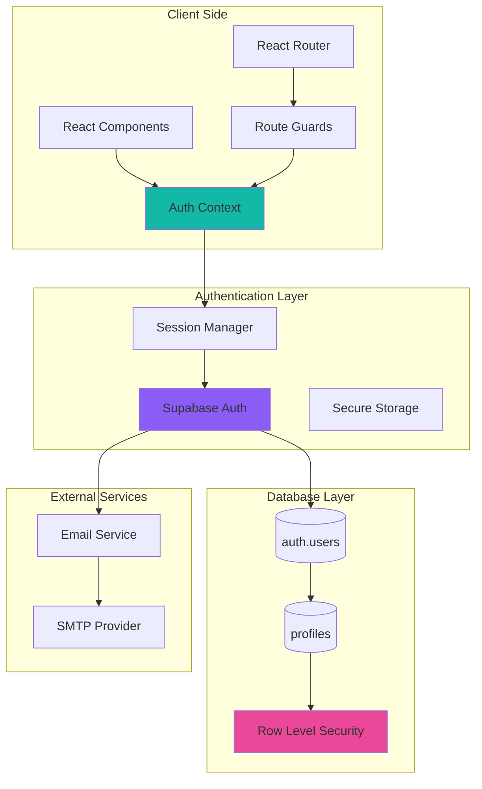
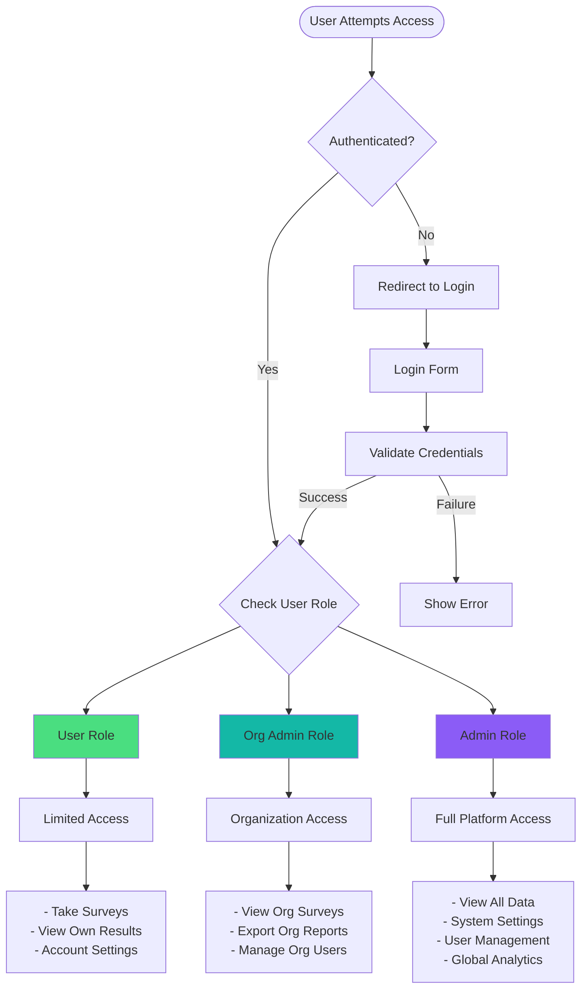
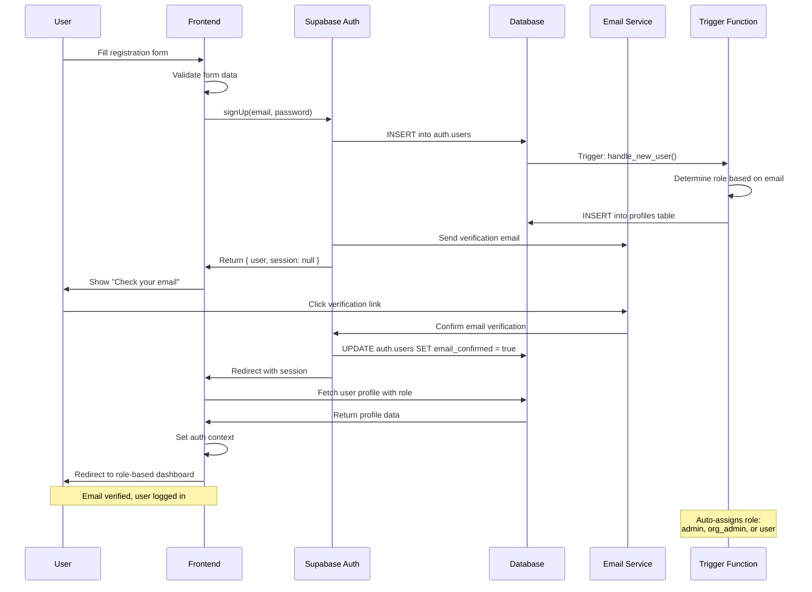
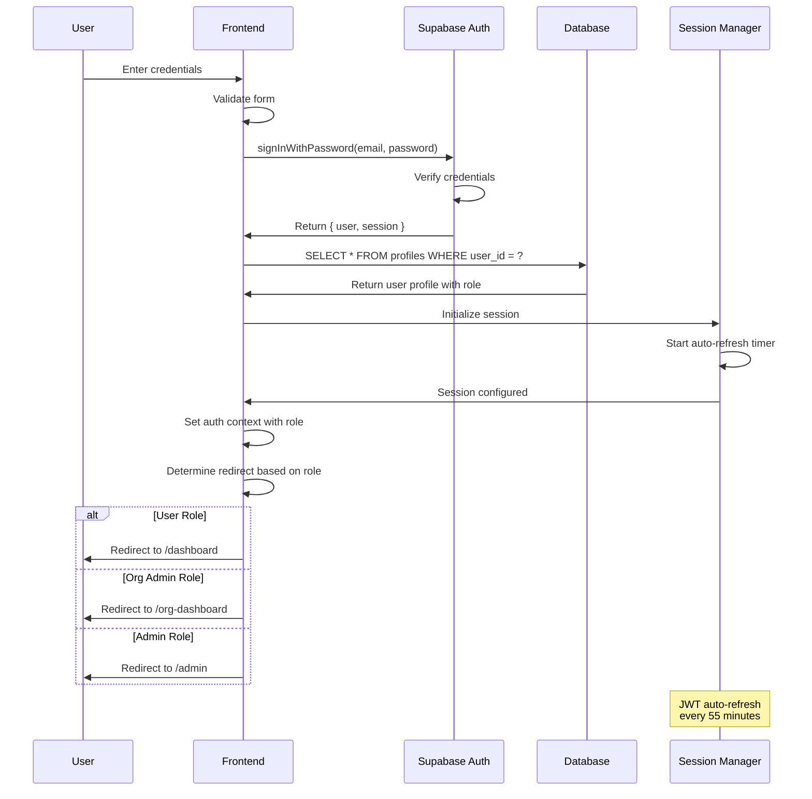
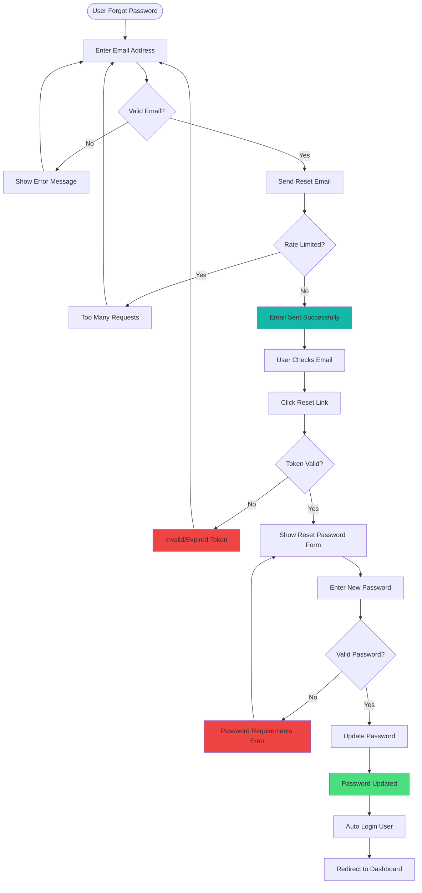
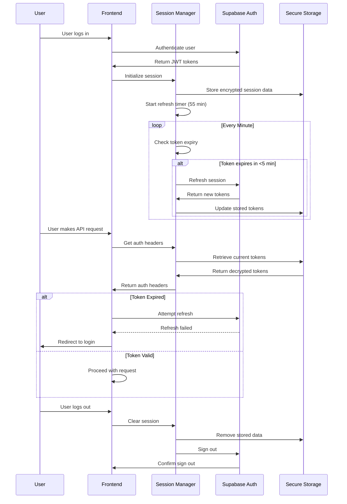
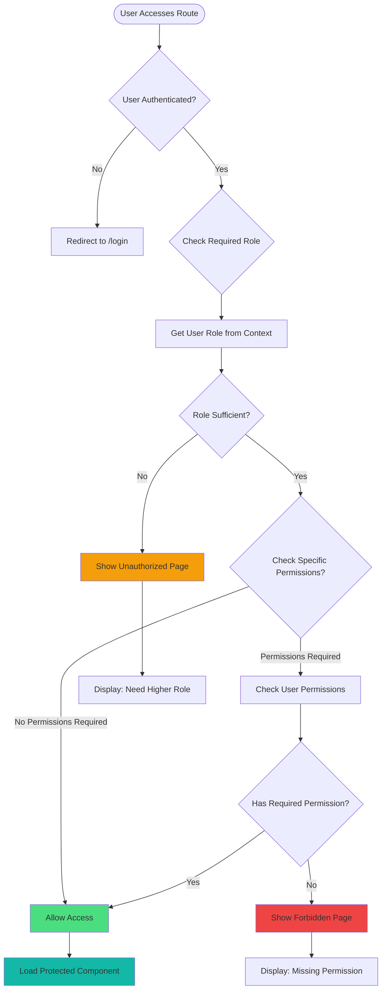
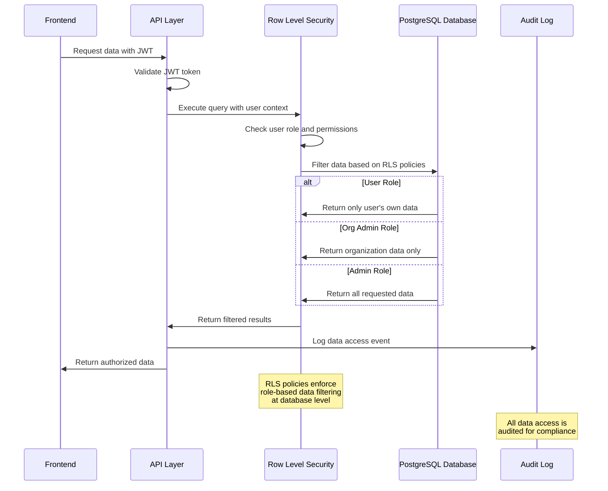

# Authentication Flow Diagrams

## Component Architecture Diagram

## Role-Based Access Control Flow

## Complete Registration Flow

## Login Authentication Flow

## Password Reset Flow

## Session Management Flow

## Route Protection Flow

## Data Access Security Flow

These diagrams provide a comprehensive visual representation of the authentication system architecture, showing how components interact and how data flows through the system while maintaining security and role-based access control.