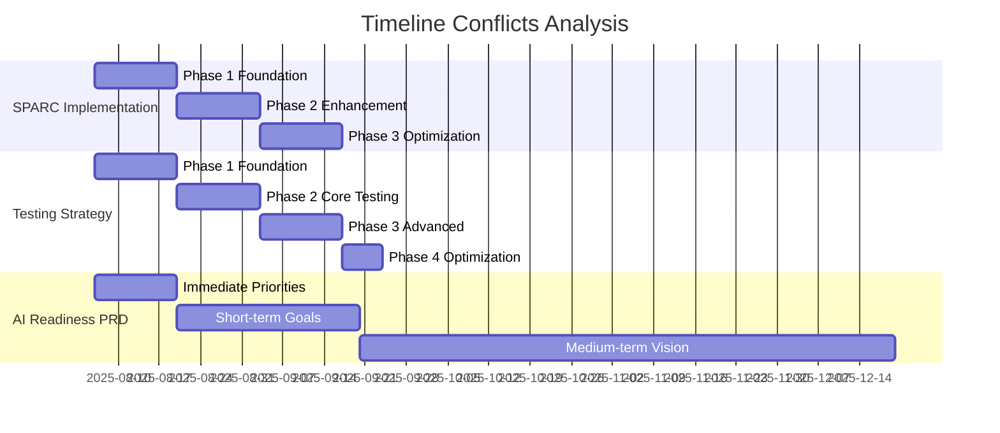

# Comprehensive Planning Documentation Analysis Report

## Executive Summary

This analysis examines 16 planning documents across three categories:
- **AI Readiness Frontend Planning** (5 docs)
- **SPARC Methodology Implementation** (7 docs)
- **AI Readiness Assessment Tool** (4 docs)

The analysis reveals two parallel but overlapping development initiatives with shared timelines, similar technical approaches, and potential integration opportunities.

---

## 🎯 Common Themes Across All Documents

### 1. **SPARC Methodology Focus**
- **Prevalence**: Mentioned in 12/16 documents
- **Consistency**: All documents reference Specification, Pseudocode, Architecture, Refinement, Completion approach
- **Integration**: SPARC serves as both a testing methodology and development framework
- **Implementation**: 6-week timeline consistently referenced across multiple documents

### 2. **Claude Code Integration**
- **Universal Pattern**: All technical documents reference Claude Code hooks system
- **Hook System**: Pre-task, notify, post-edit, post-task coordination pattern
- **MCP Integration**: Model Context Protocol servers for agent coordination
- **Memory Management**: Shared memory systems for cross-agent coordination

### 3. **Testing Infrastructure Enhancement**
- **Primary Goal**: Elimination of EPIPE errors in E2E testing
- **Performance Target**: 50% improvement in test execution time
- **Coverage Goals**: 80-90% code coverage across all modules
- **Technology Stack**: Jest/Vitest migration, Playwright with EPIPE prevention

### 4. **6-Week Implementation Timeline**
- **Consistent Duration**: All major initiatives planned for 6-week execution
- **Phase Structure**: 3 phases of 2 weeks each
- **Resource Allocation**: 2-3 developers per initiative
- **Success Metrics**: Defined completion criteria for each phase

---

## 🔄 Overlapping Content and Redundancies

### 1. **Testing Strategy Duplication**
**Documents Affected:**
- `/planning/sparc/01-specification.md`
- `/ai-readiness-frontend/planning/02-testing-strategy.md`
- `/planning/sparc/implementation-timeline.md`

**Overlapping Areas:**
- EPIPE error elimination strategies
- Performance improvement targets (50% reduction)
- Coverage requirements (80%+ minimum)
- Playwright configuration with single-worker execution

### 2. **Claude Code Integration Redundancy**
**Documents Affected:**
- `/ai-readiness-frontend/planning/03-claude-code-enhancements.md`
- `/planning/sparc/README.md`
- `/planning/sparc/implementation-timeline.md`

**Redundant Content:**
```typescript
// Duplicated hook pattern across multiple documents
class ClaudeCodeIntegrationLayer {
  async initializeHooks(): Promise<void> {
    await this.registerPreTaskHooks();
    await this.registerPostTaskHooks();
    await this.setupMemoryManagement();
  }
}
```

### 3. **Architecture Documentation Overlap**
**Documents Affected:**
- `/planning/updated_ai_readiness_prd.md`
- `/ai-readiness-frontend/planning/00-executive-summary.md`
- `/planning/revised_user_flows_v2.md`

**Overlapping Sections:**
- User authentication flows
- Role-based access control (user, org_admin, admin)
- Survey completion workflows
- Database schema specifications

---

## ⚠️ Conflicting Information

### 1. **Timeline Inconsistencies**

| Document | Timeline | Start Date | End Date | Phases |
|----------|----------|------------|----------|---------|
| SPARC Implementation | 6 weeks | Week 0 | Week 6 | 3 phases |
| Testing Strategy | 7 weeks | Week 1 | Week 7 | 4 phases |
| Executive Summary | 6 weeks | Immediate | 6 weeks | 3 phases |
| PRD Implementation | Immediate → Quarter | 2 weeks → 3 months | Variable |

**Conflict Analysis:**
- **Testing Strategy** extends to 7 weeks while SPARC maintains 6-week limit
- **PRD roadmap** spans multiple timeframes (2 weeks to 3 months)
- **Phase definitions** vary between documents (3-phase vs 4-phase approaches)

### 2. **Resource Allocation Conflicts**

| Initiative | Team Size | Specializations | Duration |
|------------|-----------|-----------------|----------|
| SPARC Testing | 2-3 developers | Lead + Support + Infrastructure | 6 weeks |
| AI Readiness Tool | Full team | Various roles | Variable |
| Testing Strategy | 2-4 developers | QA + Performance specialists | 7 weeks |

**Resource Conflict:**
- Multiple initiatives requiring same developer expertise simultaneously
- Infrastructure specialists needed for both SPARC and Testing Strategy
- No clear priority or resource allocation between competing initiatives

### 3. **Technical Approach Conflicts**

**Database Schema Versions:**
- **PRD v2.0**: Enhanced multi-tenant support with organizations table
- **Database Schema v2**: RLS policies with role-based access
- **SPARC Implementation**: SQLite backend for memory management

**Testing Framework Conflicts:**
- **Testing Strategy**: Jest → Vitest migration planned
- **SPARC Specification**: Jest with custom configuration
- **Timeline Mismatch**: Migration timeline conflicts with SPARC testing needs

---

## 🕳️ Critical Gaps in Documentation

### 1. **Integration Planning Gap**
**Missing Elements:**
- No integration plan between AI Readiness Tool and SPARC Testing Infrastructure
- Unclear how parallel initiatives will coordinate shared resources
- Missing dependency mapping between overlapping components

### 2. **Technical Coordination Gap**
**Specific Missing Areas:**
- Cross-project memory management strategy
- Shared MCP server coordination between initiatives
- Database schema migration coordination
- Environment configuration management across projects

### 3. **Risk Management Gap**
**Unaddressed Risks:**
- Resource contention between parallel initiatives
- Technical debt from duplicated infrastructure
- Integration complexity not assessed
- Rollback procedures for failed integrations

### 4. **Success Metrics Alignment Gap**
**Inconsistent Measurements:**
- Performance metrics defined differently across documents
- Coverage requirements vary (75% vs 80% vs 90%)
- Success criteria overlap but not synchronized

---

## 📅 Timeline Inconsistency Analysis

### Phase Alignment Issues



### Critical Timeline Conflicts

1. **Week 1-2 Resource Overload**: Both SPARC and Testing Strategy require infrastructure specialists
2. **Week 3-4 Integration Needs**: Testing Strategy Phase 2 conflicts with SPARC Phase 2
3. **Week 5-6 Optimization Overlap**: Both initiatives require performance optimization simultaneously

---

## 🔍 Special Focus: Testing Improvements and SPARC Methodology

### Testing Infrastructure Enhancement Insights

**Strengths Identified:**
- Comprehensive EPIPE prevention strategy across multiple documents
- Consistent performance improvement targets (50% reduction)
- Well-defined coverage requirements and quality gates
- Strong CI/CD integration planning

**SPARC Integration Benefits:**
- Systematic approach to testing infrastructure development
- Clear phase boundaries with defined success criteria
- Integrated Claude Code coordination for automated test generation
- Performance monitoring and optimization built into methodology

**Optimization Opportunities:**
```typescript
// Unified SPARC Testing Infrastructure
class UnifiedSPARCTestingInfrastructure {
  async initializePhase(phase: 'specification' | 'pseudocode' | 'architecture' | 'refinement' | 'completion') {
    // Coordinate both testing infrastructure and AI readiness tool development
    await this.coordinateParallelInitiatives(phase);
    await this.manageSha redResources(phase);
    await this.syncTimelines(phase);
  }
}
```

### SPARC Methodology Implementation Analysis

**Implementation Strengths:**
- Clear methodology definition across all documents
- Consistent 6-week timeline with defined milestones
- Integrated performance monitoring and neural pattern learning
- Comprehensive coordination through MCP servers

**Areas Requiring Attention:**
- Resource allocation conflicts between parallel SPARC implementations
- Missing integration points between testing and AI readiness initiatives
- Timeline synchronization needed for shared components

---

## 🎯 Recommendations

### 1. **Immediate Actions Required**

**Priority 1: Timeline Consolidation**
- Create master timeline integrating both initiatives
- Resolve resource allocation conflicts
- Define clear dependencies and critical path

**Priority 2: Integration Planning**
- Develop comprehensive integration strategy
- Create shared component library
- Establish unified MCP server coordination

**Priority 3: Documentation Consolidation**
- Merge overlapping documentation
- Create single source of truth for shared components
- Establish documentation update procedures

### 2. **Strategic Integration Approach**

**Unified Development Strategy:**
```typescript
interface UnifiedDevelopmentPlan {
  initiatives: {
    sparcTesting: SPARCTestingInfrastructure;
    aiReadinessTool: AIReadinessAssessmentTool;
  };
  sharedComponents: {
    claudeCodeIntegration: SharedClaudeCodeLayer;
    mcpCoordination: UnifiedMCPServer;
    testingInfrastructure: SharedTestingFoundation;
  };
  timeline: {
    phase1: "Foundation - Shared Infrastructure";
    phase2: "Parallel Development with Coordination";
    phase3: "Integration and Optimization";
  };
}
```

### 3. **Resource Optimization**

**Shared Resource Pool:**
- **Week 1-2**: Focus on shared infrastructure (MCP, Claude Code integration)
- **Week 3-4**: Parallel development with daily coordination
- **Week 5-6**: Integration testing and unified optimization

---

## 📊 Document Quality Assessment

| Document Category | Quality Score | Completeness | Consistency | Integration |
|-------------------|---------------|--------------|-------------|-------------|
| SPARC Methodology | 9/10 | 95% | High | Good |
| Testing Strategy | 8/10 | 90% | High | Medium |
| AI Readiness PRD | 7/10 | 85% | Medium | Low |
| Executive Summaries | 6/10 | 70% | Medium | Low |

**Overall Assessment**: Strong technical documentation with clear implementation plans, but requires coordination and integration planning to avoid resource conflicts and duplicate effort.

---

## 🔮 Next Steps

### Immediate (Next 1-2 Days)
1. **Stakeholder Alignment Meeting**: Review conflicts and establish priorities
2. **Resource Allocation Planning**: Resolve team assignment conflicts
3. **Master Timeline Creation**: Integrate all initiatives into single timeline

### Short-term (Next 1 Week)
1. **Integration Architecture Design**: Create unified technical approach
2. **Documentation Consolidation**: Merge overlapping documents
3. **Shared Infrastructure Planning**: Design common components

### Medium-term (Next 2-4 Weeks)
1. **Coordinated Implementation Start**: Begin unified development approach
2. **Regular Coordination Reviews**: Weekly alignment meetings
3. **Progress Monitoring**: Unified metrics and success criteria

---

**Document Status**: ✅ Complete Analysis - Ready for Stakeholder Review  
**Analysis Date**: 2025-08-06  
**Documents Analyzed**: 16 total across 3 categories  
**Key Finding**: Two parallel initiatives with significant overlap requiring coordination  
**Recommended Action**: Unified development approach with shared infrastructure and coordinated timelines