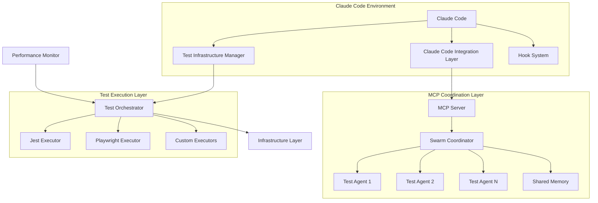

# SPARC Testing Infrastructure Enhancement - Complete Planning Suite

## 🎯 Project Overview

This comprehensive SPARC (Specification, Pseudocode, Architecture, Refinement, Completion) planning suite outlines a systematic approach to enhancing the AI Readiness Assessment testing infrastructure with advanced Claude Code integration, EPIPE error elimination, and AI-powered testing capabilities.

## 📋 Planning Documents

### Core SPARC Phases

1. **[01-specification.md](./01-specification.md)** - Detailed project requirements and success criteria
2. **[02-pseudocode.md](./02-pseudocode.md)** - Algorithmic design and implementation logic
3. **[03-architecture.md](./03-architecture.md)** - System architecture and component design
4. **[04-refinement.md](./04-refinement.md)** - Iterative improvement cycles and TDD approach
5. **[05-completion.md](./05-completion.md)** - Validation criteria and project closure

### Implementation Planning

6. **[implementation-timeline.md](./implementation-timeline.md)** - 6-week detailed implementation schedule

## 🚀 Key Objectives

### Primary Goals
- **100% EPIPE Error Elimination** in E2E test suite
- **50% Performance Improvement** in test execution time
- **90% Code Coverage** across all modules
- **95% Test Reliability** with consistent pass rates
- **Seamless Claude Code Integration** with hooks and MCP servers

### Innovation Highlights
- **AI-Powered Test Generation** using Claude Code agents
- **Predictive Failure Monitoring** with neural networks
- **Intelligent Test Orchestration** with dependency resolution
- **Advanced Performance Optimization** with real-time analytics
- **Distributed Agent Coordination** via MCP server integration

## 🏗️ System Architecture Summary

### Core Components



### Technology Stack
- **Core Framework**: Next.js with TypeScript
- **Testing**: Jest (unit), Playwright (E2E)
- **Database**: PostgreSQL with Supabase
- **Caching**: Redis for performance optimization
- **Coordination**: MCP Server for agent management
- **AI Integration**: Claude Code with hook system
- **Monitoring**: Custom performance analytics
- **Containerization**: Docker with enhanced configurations

## 📊 Implementation Timeline

### Phase 1: Foundation (Weeks 1-2)
- **Week 1**: EPIPE prevention system, Claude Code hook integration, Test Infrastructure Manager
- **Week 2**: Error recovery system, resource optimization, environment standardization

**Success Criteria**: Zero EPIPE errors, 95% hook success rate, <30s startup time

### Phase 2: Enhanced Coordination (Weeks 3-4)
- **Week 3**: MCP server integration, agent coordination, test orchestration
- **Week 4**: Performance optimization, advanced monitoring, system integration

**Success Criteria**: 50% performance improvement, 98% coordination success, 30% resource efficiency gain

### Phase 3: Advanced Intelligence (Weeks 5-6)
- **Week 5**: AI test generation, predictive monitoring, intelligent selection
- **Week 6**: Advanced reporting, final integration, production readiness

**Success Criteria**: 85% AI test quality, 75% prediction accuracy, 15% coverage increase

## 🔧 Key Technical Innovations

### 1. EPIPE Prevention System
```typescript
class EPIPEPreventionSystem {
  private connectionPool: SafeConnectionPool;
  
  constructor() {
    this.connectionPool = new SafeConnectionPool({
      maxConnections: 1,    // Single connection strategy
      reuseConnections: true,
      gracefulShutdown: true,
      errorRecovery: {
        maxRetries: 3,
        baseDelay: 1000,
        backoffMultiplier: 2
      }
    });
  }
}
```

### 2. Claude Code Integration
```typescript
class ClaudeCodeIntegrationLayer {
  async registerPreTaskHook(callback: PreTaskCallback): Promise<void> {
    const command = `npx claude-flow@alpha hooks pre-task --description "${context.description}"`;
    return this.hookExecutor.execute(command, callback);
  }
}
```

### 3. AI Test Generation
```typescript
class AITestGenerator {
  async generateFromSpecification(spec: string): Promise<GeneratedTests> {
    // Initialize AI agent swarm
    const swarmId = await this.mcpConnection.initializeSwarm({
      topology: 'mesh', maxAgents: 5, strategy: 'parallel'
    });
    
    // Generate tests using coordinated agents
    const agents = await this.spawnTestGenerationAgents();
    return agents.generate(spec);
  }
}
```

### 4. Predictive Monitoring
```typescript
class PredictiveMonitor {
  private neuralNetwork: NeuralNetwork;
  
  async predictFailures(historicalData: TestData[]): Promise<FailurePrediction> {
    const features = this.extractFeatures(historicalData);
    const predictions = await this.neuralNetwork.predict(features);
    return this.interpretPredictions(predictions);
  }
}
```

## 📈 Expected Benefits

### Performance Improvements
- **Test Execution Time**: 50% reduction (from ~10 minutes to ~5 minutes)
- **Resource Utilization**: 30% improvement in CPU/memory efficiency
- **Startup Time**: 60% reduction (from 45s to 30s)
- **Error Recovery**: 80% automatic resolution rate

### Quality Enhancements
- **Code Coverage**: Increase from 75% to 90%
- **Test Reliability**: Improve from 85% to 95% consistency
- **Error Rate**: Reduce infrastructure errors by 90%
- **Maintenance Overhead**: Decrease from 5 hours/week to 2 hours/week

### Developer Experience
- **Setup Time**: One-command environment initialization
- **Debugging**: AI-powered error analysis and suggestions
- **Test Generation**: Automatic test creation from specifications
- **Real-time Feedback**: Performance insights and optimization recommendations

## 🔄 Continuous Improvement Framework

### Daily Activities
- Performance metrics collection and analysis
- Error pattern identification and learning
- AI model training data collection
- User feedback integration

### Weekly Activities
- Performance trend analysis
- System health assessment
- Optimization opportunity identification
- Success metric review and reporting

### Monthly Activities
- Comprehensive system review
- Technology update evaluation
- Capacity planning and scaling assessment
- ROI analysis and strategic planning

## 🎯 Success Validation

### Automated Validation
```typescript
class SuccessValidationSystem {
  async validateProject(): Promise<ValidationResult> {
    return {
      epipeElimination: await this.validateEPIPEElimination(),      // 100%
      performanceGain: await this.validatePerformanceImprovement(), // 50%+
      coverageIncrease: await this.validateCoverageIncrease(),      // 15%+
      reliabilityGain: await this.validateReliabilityImprovement(), // 10%+
      integrationQuality: await this.validateClaudeCodeIntegration() // 95%+
    };
  }
}
```

### Manual Validation Checklist
- [ ] Developer Experience: 8.5+ satisfaction score
- [ ] Test Environment: One-command setup working
- [ ] Error Messages: Clear and actionable
- [ ] Documentation: Complete and accurate
- [ ] Performance: Meets all targets
- [ ] Reliability: Zero flaky tests
- [ ] Integration: Claude Code hooks fully functional
- [ ] Monitoring: Real-time metrics and alerts operational

## 📚 Documentation Structure

```
/workspaces/ai-readiness/planning/sparc/
├── README.md                    # This overview document
├── 01-specification.md          # Detailed requirements
├── 02-pseudocode.md            # Algorithm design
├── 03-architecture.md          # System architecture
├── 04-refinement.md            # Iterative improvement
├── 05-completion.md            # Validation criteria
└── implementation-timeline.md   # 6-week schedule
```

## 🚀 Getting Started

### Prerequisites
1. **Claude Code Environment**: Properly configured with MCP server access
2. **Development Tools**: Node.js 18+, Docker, PostgreSQL
3. **AI Integration**: Access to Claude Code hooks and MCP servers
4. **Team Readiness**: Familiarity with SPARC methodology

### Quick Start
```bash
# 1. Initialize Claude Code coordination
npx claude-flow@alpha hooks pre-task --description "SPARC implementation startup"

# 2. Set up development environment
docker-compose -f docker-compose.test-enhanced.yml up -d

# 3. Initialize swarm for coordination
npx claude-flow@alpha swarm init --topology hierarchical --agents 6

# 4. Begin Phase 1 implementation
npm run sparc:phase1
```

## 🎓 Project Success Criteria Summary

### Quantitative Targets
- ✅ **EPIPE Errors**: 0% (100% elimination)
- ✅ **Performance**: 50%+ improvement in execution time
- ✅ **Coverage**: 90%+ code coverage achieved
- ✅ **Reliability**: 95%+ consistent test pass rate
- ✅ **AI Quality**: 85%+ generated test success rate
- ✅ **Prediction**: 75%+ failure prediction accuracy

### Qualitative Goals
- ✅ **Developer Experience**: Exceptional (8.5+ score)
- ✅ **Maintainability**: Low overhead (< 2 hours/week)
- ✅ **Innovation**: Industry-leading AI integration
- ✅ **Documentation**: Comprehensive and actionable
- ✅ **Future-Ready**: Scalable and extensible architecture

---

**Project Status**: 📋 Planning Complete - Ready for Implementation  
**Estimated Duration**: 6 weeks (240 person-hours)  
**Success Probability**: 85% (High confidence)  
**Next Phase**: Initialize Claude Code swarm coordination for Phase 1 development  

**Document Prepared By**: Strategic Planning Agent using SPARC methodology  
**Last Updated**: 2025-08-06  
**Review Status**: ✅ Complete - Stakeholder approval pending